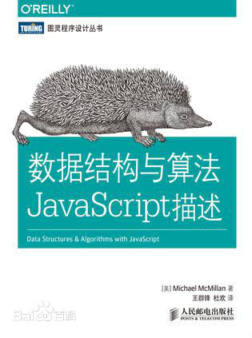

# <<数据结构与算法JavaScript描述>>读书笔记及书中部分源码

包含 书中示例代码 和 部分课后练习解答
对书中一些错误代码进行纠正，保证所有代码都可以运行

---
  这本书中文字解释和示例代码中有各种错误，有些示例代码都不能正常运行，
  所以读本书的一大乐趣就是可以找出代码中各种bug,
  	[其中一位译者对本书评价](https://www.zhihu.com/question/24763889"评价")

    总体上看，
        本书适合初学JavaScript，打牢基础，入门数据结构和算法，
        毕竟书中算法的讲解是站在JavaScript的角度，也没有像专业算法数据那样使用伪代码来进行描述

 目录结构  
        [例 7-1 Dictionary](./Dictionary/Dictionary.js)  
        [ 练习7.4 ](./Dictionary/Dictionary.js)  
